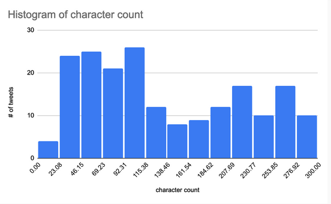

# twitter-sentiment-analysis
The objective of this project is to explore the accurcy of sentiment analysis when performed on Tweets, using the keyword "vaccine".

The model implemented is developed in python using several libraries, as noted in the imports of the file. The program imports the API keys generated with a Twitter account, the NLTK Sentiment Analysis Analyzer, and several numbers libraries which performs calculations per tweet.

We perform the categorization by first defining the list variable “tweets”, which is set equal to the Twitter search API call that searches for the most recent Tweets including the word “vaccine”. The API returns the most recent number of tweets requested, filtering out replies, links, and retweets. Upon collecting these tweets, the text is then analyzed with the NLTK Sentiment Analyzer library. This library first preprocesses the text with removing all stop words, generates tokens, and compares the tokens to the pre-defined lexicon from Vader. 

## Results
Upon running two tests of 100 Tweets, we gathered the following results on Tweet Classifications
True
Positive
25
Negative
67
Neutral
22

False
Positive
33
Negative
18
Neutral
34

### Histogram

Average char length: 138.1

### Discussion
The model implemented had an average of 57.7% accuracy on Tweets. Noted observations include shorter Tweets with less than 5 words were defaulted to the neutral classification which impacted the accuracy of the model, among other factors.

## Project Dependencies
```
pip install nltk
pip install textblob
pip install tweepy
```